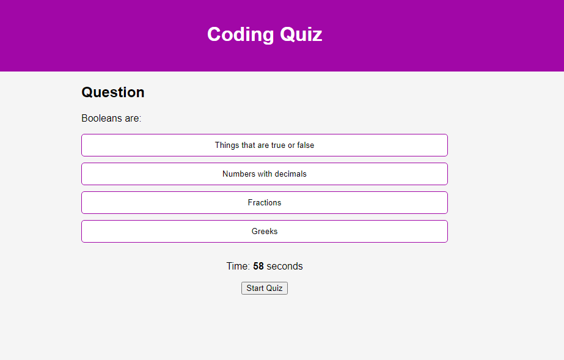

# alocke-code-quiz
A coding quiz made for the UNH coding bootcamp. When the user starts the quiz, a timer will begin. The user will be displayed a question with multiple options. By answering the questions correctly by clicking the correct option, the user will accrue points. By answering incorrectly the user will lose time to complete the quiz. 

At the end of the quiz their score will be displayed and an option to save their high-score will be available. (WIP)

# Screenshot

# Link to working GitHub page

https://alexanderlocke.github.io/alocke-code-quiz/